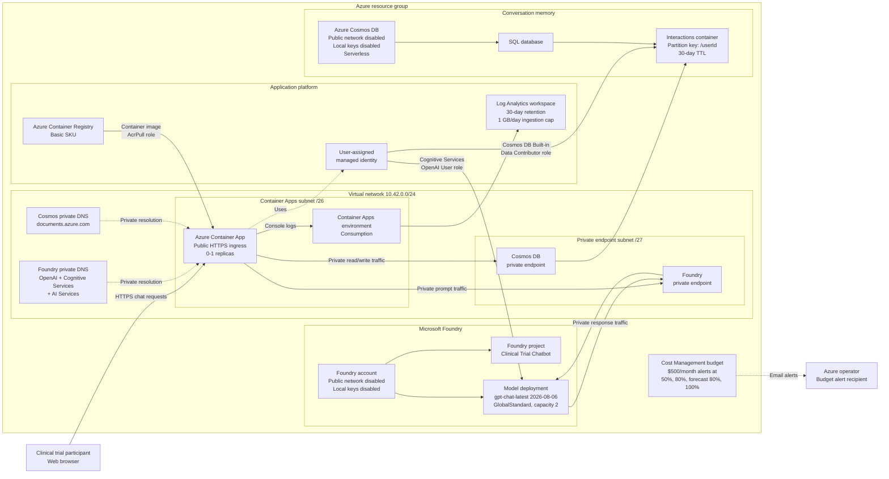

# Clinical Trial Chatbot on Microsoft Foundry

A small, end-to-end demonstration of a customer-facing clinical trial chatbot built with Microsoft Foundry. The app answers common, non-medical trial questions, remembers each demo user's recent conversations, and stores every interaction in Azure Cosmos DB.

> **Demo only:** This chatbot does not provide medical advice, determine trial eligibility, or replace a study team. Do not enter names, medical record numbers, or other protected health information (PHI).

## What this demonstrates

- A Microsoft Foundry account and project defined with Bicep.
- The latest documented GPT chat model, `gpt-chat-latest` version `2026-08-06`, deployed with the `GlobalStandard` SKU.
- Passwordless access from Azure Container Apps by using managed identity.
- Per-user conversation memory persisted in Azure Cosmos DB.
- A simple ASP.NET Core API and browser chat experience.
- Starter questions that show the intended clinical trial use cases.

`gpt-chat-latest` version `2026-08-06` is a preview model. It is used because this project intentionally demonstrates the latest chat model. For production or regulated workloads, select an approved generally available model and complete security, privacy, compliance, and clinical review.

## Sample questions

- What is a clinical trial?
- What happens during a screening visit?
- What questions should I ask the study team before joining?
- Can I leave a clinical trial after it starts?
- Who pays for trial-related care?
- What should I do if I experience a side effect?

The sample questions are stored in `src/ClinicalTrialChat.Api/Data/sample-questions.json`, displayed in the UI, and referenced by the assistant's system instructions.

## Architecture



The browser keeps a random demo user ID in local storage. The API uses that ID as the Cosmos DB partition key, loads a bounded window of recent messages before each model call, and saves both the user's message and the assistant's response. Returning with the same browser demonstrates memory without adding a full identity system.

The application has no stored Azure credentials. Its user-assigned managed identity pulls the container image and accesses both Foundry and Cosmos DB through role assignments. The Container Apps environment is injected into the virtual network. Private DNS resolves the normal service hostnames to private endpoint addresses, and public data-plane access is disabled on both Foundry and Cosmos DB.

The chatbot itself retains public HTTPS ingress so users can reach the demo. Container Registry and Log Analytics are outside the private dependency path. The resource-group budget sends alerts but does **not** automatically stop services; the model capacity, scale-to-zero compute, serverless database, data retention, and logging cap provide additional cost controls.

## Project layout

```text
.
├── azure.yaml
├── deployment.env.example
├── infra/
│   ├── main.bicep
│   ├── main.parameters.json
│   └── resources.bicep
├── scripts/
│   └── configure-azure-context.sh
├── src/
│   └── ClinicalTrialChat.Api/
│       ├── Data/
│       ├── Models/
│       ├── Services/
│       └── wwwroot/
└── tests/
    └── ClinicalTrialChat.Api.Tests/
```

## Prerequisites

- An Azure subscription with permission to create resources and role assignments.
- Azure Developer CLI (`azd`) and Azure CLI (`az`).
- .NET 10 SDK for local development.
- Access and quota for `gpt-chat-latest` version `2026-08-06` in the selected Azure region.
- Docker only if you want to build the container locally.

## Deploy to Azure

Copy the example configuration and enter your own tenant, subscription, location, identity, and budget email:

```bash
cp deployment.env.example deployment.env
```

Edit `deployment.env`:

```dotenv
AZURE_ENV_NAME=clinical-trial-demo
AZURE_TENANT_ID=<your-tenant-guid>
AZURE_SUBSCRIPTION_ID=<your-subscription-guid>
AZURE_LOCATION=eastus2
AZURE_PRINCIPAL_ID=<your-user-object-guid>
BUDGET_CONTACT_EMAIL=you@example.com
```

`AZURE_PRINCIPAL_ID` is optional. Leave it empty to skip developer data-plane role assignments. The setup script verifies that Azure CLI selected the configured tenant and subscription, and `azd` stores those values in its local environment before deployment.

Authenticate and import the configuration into an `azd` environment:

```bash
./scripts/configure-azure-context.sh
```

Review the values printed by the script. When they are correct, preview and deploy:

```bash
azd provision --preview
azd up
```

The example location is `eastus2`. Model availability and quota vary by subscription and region; change `AZURE_LOCATION` in `deployment.env` before running the configuration script if necessary.

After deployment, `azd` prints the public application URL.

## Run locally against Azure

After provisioning, Foundry and Cosmos DB reject public network traffic. A normal developer workstation cannot reach them even with valid Azure credentials. Local execution requires both:

- A private route into the deployed virtual network, such as point-to-site VPN or a peered development network.
- DNS resolution through the linked Azure private DNS zones.

If that private connectivity is available, provision the Azure resources first:

```bash
azd auth login
az login
azd provision
```

Export the Bicep outputs shown by `azd env get-values`, then run:

```bash
export AZURE_OPENAI_ENDPOINT="$(azd env get-value AZURE_OPENAI_ENDPOINT)"
export AZURE_OPENAI_DEPLOYMENT="$(azd env get-value AZURE_OPENAI_DEPLOYMENT)"
export COSMOS_ENDPOINT="$(azd env get-value COSMOS_ENDPOINT)"
export COSMOS_DATABASE="$(azd env get-value COSMOS_DATABASE)"
export COSMOS_CONTAINER="$(azd env get-value COSMOS_CONTAINER)"

dotnet run --project src/ClinicalTrialChat.Api
```

Your signed-in Azure identity also needs the **Cognitive Services OpenAI User** role on the Foundry account and the **Cosmos DB Built-in Data Contributor** data-plane role on the Cosmos DB account. RBAC alone does not bypass the private network boundary.

Open the URL printed by ASP.NET Core. The same browser remembers its generated demo user ID. Use **Forget me** to delete that user's stored interactions.

## API

| Method | Route | Purpose |
| --- | --- | --- |
| `GET` | `/api/questions` | Returns the curated starter questions. |
| `GET` | `/api/history/{userId}` | Returns recent messages for one demo user. |
| `POST` | `/api/chat` | Sends a message, calls Foundry, and persists both sides of the exchange. |
| `DELETE` | `/api/history/{userId}` | Deletes the demo user's stored conversation. |
| `GET` | `/health` | Reports whether the web process is running. |

Example chat request:

```json
{
  "userId": "demo-3f4c...",
  "message": "What happens during a screening visit?"
}
```

## Memory and data

Cosmos DB uses `/userId` as the partition key. Each message is a separate document containing:

- `id`
- `userId`
- `role` (`user` or `assistant`)
- `content`
- `createdAt`

Only a bounded number of recent messages is sent to the model. The API validates user IDs and message length, and the UI tells users not to submit PHI. The delete endpoint supports the demo's **Forget me** action.

## Safety boundaries

The system prompt instructs the assistant to:

- Provide general clinical trial education only.
- Never diagnose, recommend treatment, or decide eligibility.
- Direct eligibility and study-specific questions to the study team.
- Direct urgent symptoms to local emergency services.
- Clearly say when information is unknown rather than inventing study details.
- Remind users not to share PHI.

These prompt controls are educational safeguards, not a substitute for production content filtering, identity, authorization, auditing, legal review, or clinical governance.

## Clean up

Delete the Azure resources when finished:

```bash
azd down --purge
```

## Cost notes

This demo creates billable Azure resources, including a model deployment, Azure Container Apps, Azure Container Registry, Azure Cosmos DB, two private endpoints, and four private DNS zones. Cosmos DB is configured for serverless usage and the container app can scale to zero, but model, registry, Private Link, DNS, and data-processing charges may still apply.
