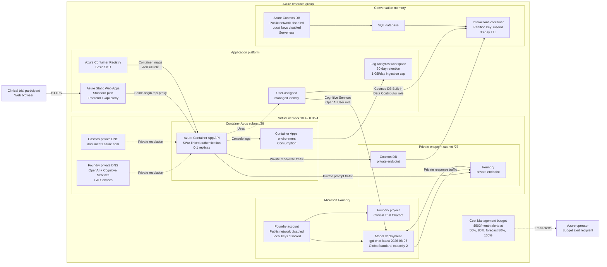

# Monitoring Microsoft Foundry with Azure Health Models

This sample project demonstrates how to monitor a Microsoft Foundry workload with Azure Health Models. It uses a customer-facing clinical trial chatbot to show native Azure Monitor metrics, workspace-based Application Insights, OpenTelemetry traces, Log Analytics KQL signals, alerting, and workload-level health rollups across Microsoft Foundry, Azure Container Apps, and Azure Cosmos DB.

The chatbot answers common, non-medical trial questions, remembers each demo user's recent conversations, and stores every interaction in Azure Cosmos DB.

> **Demo only:** This chatbot does not provide medical advice, determine trial eligibility, or replace a study team. Do not enter names, medical record numbers, or other protected health information (PHI).

See [DEPLOYMENT.md](DEPLOYMENT.md) for verified local-development, Azure deployment, testing, update, logging, and cleanup instructions.

## What this demonstrates

- A Microsoft Foundry account and project defined with Bicep.
- The latest documented GPT chat model, `gpt-chat-latest` version `2026-08-06`, deployed with the `GlobalStandard` SKU.
- Passwordless access from Azure Container Apps by using managed identity.
- Per-user conversation memory persisted in Azure Cosmos DB.
- A browser frontend on Azure Static Web Apps with a linked ASP.NET Core API.
- Starter questions that show the intended clinical trial use cases.

`gpt-chat-latest` version `2026-08-06` is a preview model. It is used because this project intentionally demonstrates the latest chat model. For production or regulated workloads, select an approved generally available model and complete security, privacy, compliance, and clinical review.

## Sample questions

- What is a clinical trial?
- What happens during a screening visit?
- What questions should I ask the study team before joining?
- Can I leave a clinical trial after it starts?
- Who pays for trial-related care?
- What should I do if I experience a side effect?

The sample questions are stored in `src/ClinicalTrialChat.Api/Data/sample-questions.json`, displayed in the UI, and referenced by the assistant's system instructions.

## Architecture



The browser keeps a random demo user ID in local storage. The API uses that ID as the Cosmos DB partition key, loads a bounded window of recent messages before each model call, and saves both the user's message and the assistant's response. Returning with the same browser demonstrates memory without adding a full identity system.

The application has no stored Azure credentials. Its user-assigned managed identity pulls the container image and accesses both Foundry and Cosmos DB through role assignments. The Container Apps environment is injected into the virtual network. Private DNS resolves the normal service hostnames to private endpoint addresses, and public data-plane access is disabled on both Foundry and Cosmos DB.

Azure Static Web Apps serves the frontend and proxies `/api/*` routes to the linked Container App. Linking adds the **Azure Static Web Apps (Linked)** authentication provider so direct anonymous traffic to the Container App is rejected. Container Registry and Log Analytics are outside the private dependency path. The resource-group budget sends alerts but does **not** automatically stop services; the model capacity, scale-to-zero compute, serverless database, data retention, and logging cap provide additional cost controls.

## Project layout

```text
.
├── azure.yaml
├── DEPLOYMENT.md
├── deployment.env.example
├── infra/
│   ├── health-model-foundry-signals.bicep
│   ├── health-model-metrics.bicep
│   ├── health-model-observability.bicep
│   ├── main.bicep
│   ├── main.parameters.json
│   └── resources.bicep
├── scripts/
│   └── configure-azure-context.sh
├── src/
│   ├── ClinicalTrialChat.Api/
│   │   ├── Data/
│   │   ├── Models/
│   │   └── Services/
│   └── ClinicalTrialChat.Web/
│       ├── app.js
│       ├── index.html
│       ├── staticwebapp.config.json
│       └── styles.css
└── tests/
    └── ClinicalTrialChat.Api.Tests/
```

## Prerequisites

- An Azure subscription with permission to create resources and role assignments.
- Azure Developer CLI (`azd`) and Azure CLI (`az`).
- .NET 10 SDK for local development.
- Access and quota for `gpt-chat-latest` version `2026-08-06` in the selected Azure region.
- Docker only if you want to build the container locally.

## Deploy to Azure

Copy the example configuration and enter your own tenant, subscription, location, identity, and budget email:

```bash
cp deployment.env.example deployment.env
```

Edit `deployment.env`:

```dotenv
AZURE_ENV_NAME=clinical-trial-demo
AZURE_TENANT_ID=<your-tenant-guid>
AZURE_SUBSCRIPTION_ID=<your-subscription-guid>
AZURE_LOCATION=eastus2
AZURE_PRINCIPAL_ID=<your-user-object-guid>
BUDGET_CONTACT_EMAIL=you@example.com
```

`AZURE_PRINCIPAL_ID` is optional. Leave it empty to skip developer data-plane role assignments. `BUDGET_CONTACT_EMAIL` receives both Cost Management budget notifications and Health Model alerts. The setup script verifies that Azure CLI selected the configured tenant and subscription, and `azd` stores those values in its local environment before deployment.

Authenticate and import the configuration into an `azd` environment:

```bash
./scripts/configure-azure-context.sh
```

Review the values printed by the script. When they are correct, preview and deploy:

```bash
azd provision --preview
azd up
```

The example location is `eastus2`. Model availability and quota vary by subscription and region; change `AZURE_LOCATION` in `deployment.env` before running the configuration script if necessary.

After deployment, `azd` prints the public application URL.

## Test the deployed app

Get the deployed URL:

```bash
app_url="$(azd env get-value APPLICATION_URL)"
echo "$app_url"
```

Open that URL in a browser, then:

1. Select **What happens during a screening visit?**
2. Ask **What visit did I ask about?** to confirm the prior turn is remembered.
3. Reload the page and confirm the same conversation returns from Cosmos DB.
4. Select **Forget me**, confirm deletion, and reload. The conversation should be empty.
5. Do not enter names, medical record numbers, or other protected health information.

The Container App can scale to zero. Allow up to a minute for the first request after an idle period.

Run basic API checks from a terminal:

```bash
curl --fail "$app_url/api/health"
curl --fail "$app_url/api/questions"

user_id="demo-$(uuidgen | tr '[:upper:]' '[:lower:]')"

curl --fail \
  --header "Content-Type: application/json" \
  --data "{\"userId\":\"$user_id\",\"message\":\"What is a clinical trial?\"}" \
  "$app_url/api/chat"

curl --fail "$app_url/api/history/$user_id"
curl --fail --request DELETE "$app_url/api/history/$user_id"
```

The expected results are:

- `/api/health` returns `{"status":"healthy"}` through the Static Web Apps proxy.
- `/api/questions` returns six starter questions.
- `/api/chat` returns an assistant message.
- `/api/history/{userId}` returns both user and assistant messages.
- `DELETE /api/history/{userId}` returns HTTP `204`.

## Run locally against Azure

After provisioning, Foundry and Cosmos DB reject public network traffic. A normal developer workstation cannot reach them even with valid Azure credentials. Local execution requires both:

- A private route into the deployed virtual network, such as point-to-site VPN or a peered development network.
- DNS resolution through the linked Azure private DNS zones.

If that private connectivity is available, provision the Azure resources first:

```bash
azd auth login
az login
azd provision
```

Export the Bicep outputs shown by `azd env get-values`, then run:

```bash
export AZURE_OPENAI_ENDPOINT="$(azd env get-value AZURE_OPENAI_ENDPOINT)"
export AZURE_OPENAI_DEPLOYMENT="$(azd env get-value AZURE_OPENAI_DEPLOYMENT)"
export COSMOS_ENDPOINT="$(azd env get-value COSMOS_ENDPOINT)"
export COSMOS_DATABASE="$(azd env get-value COSMOS_DATABASE)"
export COSMOS_CONTAINER="$(azd env get-value COSMOS_CONTAINER)"

ASPNETCORE_ENVIRONMENT=Production \
  dotnet run \
  --project src/ClinicalTrialChat.Api \
  --no-launch-profile \
  --urls http://localhost:5228
```

Your signed-in Azure identity also needs the **Cognitive Services OpenAI User** role on the Foundry account and the **Cosmos DB Built-in Data Contributor** data-plane role on the Cosmos DB account. RBAC alone does not bypass the private network boundary.

In a second terminal, serve the separate frontend:

```bash
python3 -m http.server 5173 --directory src/ClinicalTrialChat.Web
```

Open `http://localhost:5173`. The same browser remembers its generated demo user ID. Use **Forget me** to delete that user's stored interactions.

## API

| Method | Route | Purpose |
| --- | --- | --- |
| `GET` | `/api/questions` | Returns the curated starter questions. |
| `GET` | `/api/history/{userId}` | Returns recent messages for one demo user. |
| `POST` | `/api/chat` | Sends a message, calls Foundry, and persists both sides of the exchange. |
| `DELETE` | `/api/history/{userId}` | Deletes the demo user's stored conversation. |
| `GET` | `/api/health` | Reports API health through Static Web Apps. |
| `GET` | `/health` | Reports API health directly inside trusted environments. |

Example chat request:

```json
{
  "userId": "demo-3f4c...",
  "message": "What happens during a screening visit?"
}
```

## Health Model metric access

Azure platform metrics are collected automatically. If a `Microsoft.CloudHealth/healthmodels` resource reports that it cannot read metrics, grant its managed identity **Monitoring Reader** access to the monitored resource group with the standalone [health-model-metrics.bicep](infra/health-model-metrics.bicep) template. This role assignment is intentionally separate from the main application deployment. See [DEPLOYMENT.md](DEPLOYMENT.md) for preview and deployment commands.

The reviewed Foundry signal catalog, logical derived metrics, starter thresholds, and entity hierarchy are documented in [FOUNDRY_HEALTH_SIGNALS.md](docs/FOUNDRY_HEALTH_SIGNALS.md). The opt-in [health-model-foundry-signals.bicep](infra/health-model-foundry-signals.bicep) template configures inference, safety, and token-usage signals. The separate [health-model-observability.bicep](infra/health-model-observability.bicep) template adds workload rollup, Application Insights, OpenTelemetry, Log Analytics, and consolidated workload alerts without changing `main.bicep`.

## Memory and data

Cosmos DB uses `/userId` as the partition key. Each message is a separate document containing:

- `id`
- `userId`
- `role` (`user` or `assistant`)
- `content`
- `createdAt`

Only a bounded number of recent messages is sent to the model. The API validates user IDs and message length, and the UI tells users not to submit PHI. The delete endpoint supports the demo's **Forget me** action.

## Safety boundaries

The system prompt instructs the assistant to:

- Provide general clinical trial education only.
- Never diagnose, recommend treatment, or decide eligibility.
- Direct eligibility and study-specific questions to the study team.
- Direct urgent symptoms to local emergency services.
- Clearly say when information is unknown rather than inventing study details.
- Remind users not to share PHI.

These prompt controls are educational safeguards, not a substitute for production content filtering, identity, authorization, auditing, legal review, or clinical governance.

## Clean up

Delete the Azure resources when finished:

```bash
azd down --purge
```

## Cost notes

This demo creates billable Azure resources, including a Standard Azure Static Web App, model deployment, Azure Container Apps, Azure Container Registry, Azure Cosmos DB, two private endpoints, and four private DNS zones. The Standard Static Web Apps plan is required for the linked Container Apps backend and had a $9/month base retail price in `eastus2` when this project was updated. Cosmos DB is configured for serverless usage and the container app can scale to zero, but model, registry, Private Link, DNS, bandwidth, and data-processing charges may still apply.
