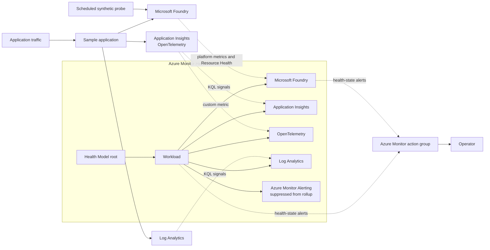

# Azure Health Models for Microsoft Foundry

This repository is a reference implementation for adding Azure Monitor Health Models to a Microsoft Foundry workload. It demonstrates how to turn Foundry platform metrics, application telemetry, logs, dependencies, and alerts into one workload-level health model.

The included chat application exists to generate realistic telemetry. Replace it with your own Foundry application while reusing the Health Model patterns and Bicep templates.

> Azure Monitor Health Models and the `Microsoft.CloudHealth` API used by this sample are in preview. Review every deployment and validate the signal behavior before using it in production.

## What this example provides

- Foundry availability, latency, responsible AI, token usage, and Azure Resource Health signals.
- Application Insights signals for request failures and latency.
- A custom OpenTelemetry signal exported through Application Insights.
- Log Analytics signals for runtime and ingress failures.
- A workload entity that rolls up the health of its dependencies.
- Entity-state alerts delivered through an Azure Monitor action group.
- A scheduled synthetic request that keeps Foundry metrics populated for low-traffic workloads.
- Standalone RBAC deployment for Health Model access to metrics and logs.

## Architecture



## Health Model design

```text
Health Model root
└── Workload
    ├── Microsoft Foundry
    ├── Application Insights
    ├── OpenTelemetry
    ├── Log Analytics
    └── Azure Monitor Alerting (suppressed)
```

The workload uses worst-of dependency rollup. A dependency with `Standard` impact can therefore propagate its state to the workload and then to the root entity. The alerting entity represents configuration only and is suppressed from health propagation.

## Included signal layers

| Layer | Included signals |
| --- | --- |
| Microsoft Foundry | Resource Health, availability, time to last byte, harmful requests, content-filter blocks, and inference-token consumption |
| Application Insights | API error rate and P95 request duration |
| OpenTelemetry | Application-observed Foundry HTTP 5xx errors |
| Log Analytics | Container runtime errors and ingress 5xx responses |

The templates contain starter thresholds, not universal production defaults. Baseline your own traffic, latency, token volume, and safety behavior before selecting thresholds.

See [Foundry Health Model Signal Catalog](docs/FOUNDRY_HEALTH_SIGNALS.md) for metric names, query definitions, thresholds, limitations, and future signal ideas.

## Reusable infrastructure

| File | Purpose |
| --- | --- |
| [`infra/health-model-metrics.bicep`](infra/health-model-metrics.bicep) | Grants the Health Model identity access to Azure metrics and, optionally, Log Analytics |
| [`infra/health-model-foundry-signals.bicep`](infra/health-model-foundry-signals.bicep) | Configures platform signals and Resource Health directly on an existing Foundry entity |
| [`infra/health-model-observability.bicep`](infra/health-model-observability.bicep) | Adds the workload hierarchy, application telemetry layers, relationships, and alerts |
| [`infra/foundry-health-probe.bicep`](infra/foundry-health-probe.bicep) | Runs a direct Foundry request on a one-minute Container Apps Job schedule |
| [`infra/observability.bicep`](infra/observability.bicep) | Creates Application Insights and the shared alert action group for the sample workload |
| [`infra/main.bicep`](infra/main.bicep) | Deploys the complete example application and supporting resources |

The Health Model templates are intentionally separate from the main application deployment. This lets you apply the monitoring pattern to an existing Foundry project without coupling it to the sample application's lifecycle.

## Deployment flow

### Prerequisites

- An Azure subscription with permissions to create resources and role assignments.
- Azure CLI, Azure Developer CLI, and `jq`.
- Access and quota for a compatible Foundry model in the target region.
- An existing Azure Monitor Health Model for the signal templates to update.

### 1. Deploy the example workload

```bash
cp deployment.env.example deployment.env
./scripts/configure-azure-context.sh

azd provision --preview
azd up
```

The environment-specific file `deployment.env` is ignored by Git. Keep subscription IDs, tenant IDs, account details, and email addresses out of committed files.

### 2. Grant the Health Model access

Deploy [`infra/health-model-metrics.bicep`](infra/health-model-metrics.bicep) at the scope containing the monitored resources. This grants the Health Model managed identity the roles required to read platform metrics and Log Analytics data.

### 3. Configure Foundry signals

Deploy [`infra/health-model-foundry-signals.bicep`](infra/health-model-foundry-signals.bicep) against the entity that represents your Foundry account.

### 4. Add workload observability

Deploy [`infra/health-model-observability.bicep`](infra/health-model-observability.bicep) to add application telemetry entities, workload rollup, relationships, and action-group alerts.

See [Deployment guide](DEPLOYMENT.md) for complete commands, parameter discovery, validation, logs, updates, and cleanup.

## Adapting this example

1. **Map your Foundry resource.** Supply the existing Foundry account resource ID and Health Model entity name.
2. **Select relevant Foundry metrics.** Keep only the inference, safety, and usage signals that match your deployment type.
3. **Replace application queries.** Update the Application Insights role name, Log Analytics tables, resource filters, and custom metric names.
4. **Model real dependencies.** Make the workload the parent of the services it depends on so health propagates in the correct direction.
5. **Tune impact and rollup.** Use `Standard`, `Limited`, or `Suppressed` impact and choose a dependency aggregation strategy that reflects user impact.
6. **Baseline thresholds.** Treat the included thresholds as starting points.
7. **Configure alert recipients.** Connect entity-state alerts to your own action groups.
8. **Decide whether synthetic traffic is appropriate.** The included probe keeps Foundry metrics active but is not an end-to-end application test.

## Important behavior

- Health Models evaluate telemetry already collected by Azure Monitor; they do not collect the source telemetry themselves.
- Missing metric data can produce `Unknown`. Request traffic alone does not make an entity healthy.
- KQL signals should return one numeric value and explicitly return zero when no matching records exist.
- Entity updates replace the complete `signalGroups` value. Preview deployments and keep each template as the source of truth for every signal that should remain on the entity.
- Foundry signals in this sample aggregate at the account level because raw dimension filters do not reliably round-trip through the preview API and portal editor.
- The scheduled probe calls Foundry directly. It does not validate the application, frontend, or data store.
- Agent-run, continuous-evaluation, and red-team signals are not included because the sample uses direct chat completions rather than Foundry Agent Service.

## Repository guide

| Path | Contents |
| --- | --- |
| [`infra/`](infra/) | Application infrastructure and reusable Health Model templates |
| [`docs/FOUNDRY_HEALTH_SIGNALS.md`](docs/FOUNDRY_HEALTH_SIGNALS.md) | Detailed signal catalog and design rationale |
| [`DEPLOYMENT.md`](DEPLOYMENT.md) | End-to-end deployment and operations guide |
| [`src/`](src/) | Sample Foundry workload and synthetic probe |
| [`tests/`](tests/) | Application and probe tests |

## Validate

```bash
dotnet test ClinicalTrialChat.slnx
```

Always run a Bicep `what-if` or `azd provision --preview` before applying infrastructure changes.

## Cost and cleanup

The example deploys billable Azure resources, and the one-minute probe continuously consumes Container Apps execution time and Foundry tokens. Review the Azure pricing calculator and your subscription's free grants before leaving the sample running.

Delete the example workload when it is no longer needed:

```bash
azd down --purge
```

Health Models or entities created outside the main `azd` deployment may require separate cleanup.
