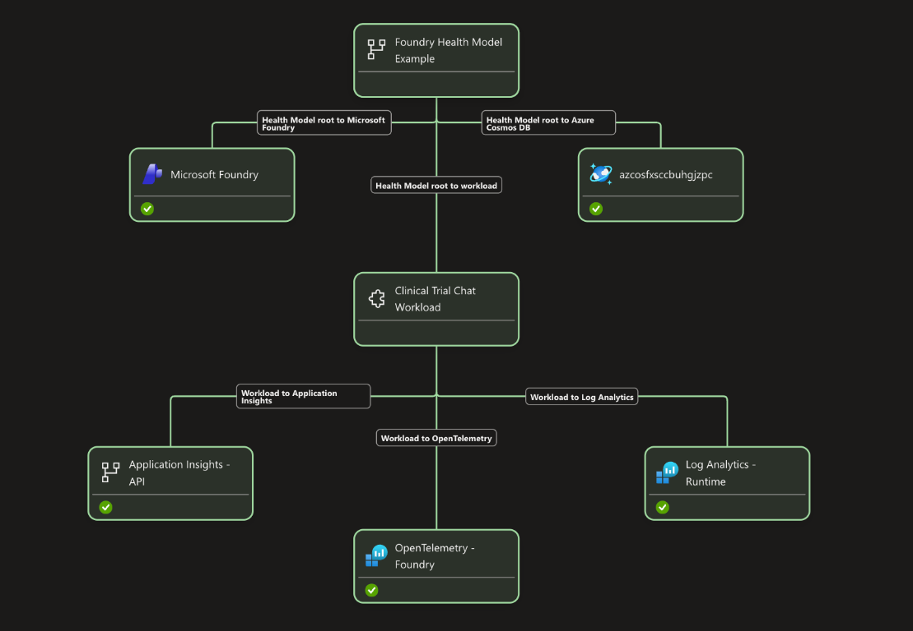

# Azure Health Models for Microsoft Foundry

This repository is a reference implementation for monitoring a Microsoft Foundry chat workload with Azure Monitor Health Models. It combines Foundry platform metrics, Azure Resource Health, Application Insights, OpenTelemetry, and Log Analytics into one workload-level health view.

The included chat application and scheduled probe generate realistic telemetry. Reuse the signal patterns and Bicep templates with your own Foundry workload.

**Live application:** [Clinical Trial Chat](https://ambitious-glacier-0cabb320f.7.azurestaticapps.net/)

Validate signal behavior and tune every threshold before using the model in production.

## Sample Azure Health Model signals

The project configures 11 threshold-based signals plus Azure Resource Health. Each threshold signal evaluates a one-minute window and refreshes every minute so newly ingested failures affect health as quickly as the preview service allows.

The thresholds are starting points, not universal production defaults. Baseline your own traffic, latency, token volume, and failure patterns before changing an entity's production health state.

A one-minute query window prioritizes fast state changes but can miss telemetry that arrives late; widen the window if production ingestion latency makes signals intermittent.

| Health Model entity | Signal | Azure Monitor source | Degraded | Unhealthy |
| --- | --- | --- | --- | --- |
| Microsoft Foundry | Resource health | Azure Resource Health | Azure-reported state | Azure-reported state |
| Microsoft Foundry | Foundry availability | `AzureOpenAIAvailabilityRate` | `< 99%` | `< 95%` |
| Microsoft Foundry | Time to last byte | `AzureOpenAITTLTInMS` | `> 500 ms` | `> 10,000 ms` |
| Microsoft Foundry | Harmful requests detected | `RAIHarmfulRequests` | `> 0` | `> 5` |
| Microsoft Foundry | Requests blocked by content filters | `RAIRejectedRequests` | `> 0` | `> 10` |
| Microsoft Foundry | Inference-token consumption | `TokenTransaction` | `> 25,000` | `> 50,000` |
| Application Insights | API error rate | `AppRequests` KQL query | `> 1%` | `> 5%` |
| Application Insights | API P95 duration | `AppRequests` KQL query | `> 15,000 ms` | `> 30,000 ms` |
| OpenTelemetry | Application-observed Foundry HTTP 5xx errors | `foundry.server_errors` in `AppMetrics` | `> 0` | `> 3` |
| OpenTelemetry | Maximum Foundry client duration | `gen_ai.client.operation.duration` in `AppMetrics` | `> 25 ms` | `> 50 ms` |
| Log Analytics | Container runtime errors | `ContainerAppConsoleLogs_CL` KQL query | `> 5` | `> 20` |
| Log Analytics | Container ingress HTTP 5xx responses | `ContainerAppHTTPLogs` KQL query | `> 0` | `> 5` |

The Foundry platform signals are configured in [`infra/health-model-foundry-signals.bicep`](infra/health-model-foundry-signals.bicep). The application, OpenTelemetry, and Log Analytics signals are configured in [`infra/health-model-observability.bicep`](infra/health-model-observability.bicep).

### Foundry availability and idle traffic

`AzureOpenAIAvailabilityRate` is calculated as:

```text
(Total Calls - Server Errors) / Total Calls
```

Server errors include Foundry responses with HTTP status codes of 500 or greater. When no requests reach Foundry during an evaluation window, the metric has no request denominator and can appear as `0%` or no data. Depending on Health Model evaluation behavior, this can make the signal look unhealthy or `Unknown` even though Foundry has not returned an error.

There are two ways to avoid treating an idle workload as a Foundry outage:

#### Option 1: Keep the Foundry availability signal populated with a probe

[`infra/foundry-health-probe.bicep`](infra/foundry-health-probe.bicep) deploys a scheduled Container Apps Job that sends one direct chat-completion request to Foundry every minute. This keeps `AzureOpenAIAvailabilityRate` populated and exercises the managed identity, private network, DNS, and Foundry request path.

The probe does not test the frontend, application API, or Cosmos DB. It also consumes Container Apps execution time and Foundry tokens, so include that synthetic traffic in cost and capacity planning.

#### Option 2: Mimic availability health with OpenTelemetry

The application emits the `foundry.server_errors` counter whenever its OpenAI client receives a Foundry response with a status code of 500 or greater. The Health Model KQL query returns zero when the application observes no matching server errors, so an idle interval does not become an artificial availability failure.

This is a count-based mimic of the native availability signal's failure semantics, not the same percentage calculation:

- `AzureOpenAIAvailabilityRate` covers all requests to the Foundry account.
- `foundry.server_errors` covers only requests made by this application.
- The OTEL signal detects application-observed 5xx responses but does not independently prove Foundry is reachable when there is no traffic.

Use the probe when you need the native account-level availability metric and an active end-to-end Foundry check. Use the OTEL signal when application-observed server failures are sufficient and you want idle windows to evaluate as zero errors. You can keep both for correlated coverage, but they intentionally report overlapping Foundry 5xx failures.

### Foundry latency

`AzureOpenAITTLTInMS` measures the time from sending a request until the last response byte arrives. It is the appropriate end-to-end latency signal for this sample's non-streaming chat completions.

Time to Response, Time Between Tokens, and Tokens per Second are not currently available for Standard deployments. Pair latency with token volume when investigating changes: higher latency with proportional token growth can be expected, while latency growth without token growth can indicate a service or network problem.

### Foundry responsible AI

`RAIHarmfulRequests` counts requests detected as harmful, while `RAIRejectedRequests` counts requests blocked by content filters. A rejection often means a guardrail worked as designed, but both signals affect the Foundry entity because individual signals cannot be suppressed from dependency rollup.

The signals aggregate at the Foundry account level. Raw metric dimension filters do not reliably round-trip through the preview Health Models API and portal editor, so the templates intentionally leave `dimensionFilter` unset.

### Foundry usage

`TokenTransaction` counts prompt and generated inference tokens. Its thresholds are configurable through `tokenUsageDegradedThreshold` and `tokenUsageUnhealthyThreshold` in [`infra/health-model-foundry-signals.bicep`](infra/health-model-foundry-signals.bicep).

Do not use the legacy Cognitive Services metrics `TotalCalls`, `SuccessfulCalls`, `TotalErrors`, `BlockedCalls`, `ServerErrors`, `ClientErrors`, or `Latency` for Azure OpenAI workloads. Their definitions are not designed for Azure OpenAI monitoring.

### Application Insights

The API error-rate signal calculates failed `AppRequests` as basis points of total requests and explicitly returns zero when no failed requests are found. The duration signal evaluates P95 API request duration. Both queries scope telemetry to the `clinical-trial-chat-api` application role.

These signals describe application behavior, not only Foundry behavior. For example, Cosmos DB failures can increase the API error rate without affecting Foundry availability.

### OpenTelemetry

[`ChatTelemetry`](src/ClinicalTrialChat.Api/Services/ChatTelemetry.cs) defines the `foundry.server_errors` counter, and [`AzureFoundryChatService`](src/ClinicalTrialChat.Api/Services/AzureFoundryChatService.cs) records it for every Foundry response with a status code of 500 or greater.

The metric includes no prompt text, response body, user ID, status-code attribute, or other high-cardinality data. It is exported to Application Insights and queried from `AppMetrics`.

The deployed application also enables the OpenAI .NET SDK's experimental OpenTelemetry instrumentation for the actual `ChatClient` request. It subscribes to the `OpenAI.ChatClient` activity source and meter, which emit a client span, operation duration, token usage, response model, response ID, finish reason, and error status using `gen_ai.*` semantic-convention attributes. Message-content capture remains disabled.

The Health Model converts the SDK's `gen_ai.client.operation.duration` histogram from seconds to milliseconds and evaluates the maximum duration observed each minute. The demonstration thresholds make the signal degraded above 25 ms and unhealthy above 50 ms, so a real chat request intentionally exercises the unhealthy alert path. Raise both thresholds after validating alert delivery to avoid excessive state transitions.

The Microsoft Foundry tracing article recommends server-side tracing for prompt and hosted agents. This sample is not a hosted agent: it invokes a Foundry model directly through `ChatClient`, so it uses client-side SDK instrumentation instead. The infrastructure connects the existing Application Insights resource to the Foundry project with project-managed-identity authentication and grants the project identity permission to publish telemetry. Direct model traces are available in Application Insights; agent-specific Foundry dashboards still require a Foundry agent or workflow that emits `gen_ai.agent.*` attributes.

### Log Analytics

The runtime signal detects stderr records, failed log entries, and unhandled exceptions in `ContainerAppConsoleLogs_CL`.

The ingress signal detects application HTTP 5xx responses in `ContainerAppHTTPLogs`. That table is available only after enabling Container Apps HTTP diagnostic logs on the managed environment. Without that diagnostic setting, the signal remains `Unknown`. Review the privacy and ingestion-cost implications because HTTP logs can include paths, user agents, and client IP addresses.

## Health Model structure

```text
Foundry Health Model Example
├── Microsoft Foundry
├── Azure Cosmos DB
└── Clinical Trial Chat Workload
    ├── Application Insights - API
    ├── OpenTelemetry - Foundry
    └── Log Analytics - Runtime
```



The root directly parents the existing Foundry, Cosmos DB, and workload entities. The observability template manages those relationships but does not replace the existing Cosmos DB entity. The workload uses `WorstOf` dependency rollup with `ignoreUnknown: true` for its Application Insights, OpenTelemetry, and Log Analytics children. Alerts reference the shared Azure Monitor action group directly; the action group is not modeled as an entity because action groups expose no evaluatable metric or Resource Health signal.

## Deploy

Prerequisites include an Azure subscription, Azure CLI, Azure Developer CLI, `jq`, Foundry model access, and an existing Azure Monitor Health Model.

```bash
cp deployment.env.example deployment.env
./scripts/configure-azure-context.sh

azd provision --preview
azd up
```

The Health Model templates are separate from the main application deployment so they can also be applied to an existing Foundry workload:

| Template | Purpose |
| --- | --- |
| [`infra/health-model-metrics.bicep`](infra/health-model-metrics.bicep) | Grants the Health Model identity access to Azure metrics and Log Analytics |
| [`infra/health-model-foundry-signals.bicep`](infra/health-model-foundry-signals.bicep) | Adds Foundry platform metrics and Resource Health to an existing Foundry entity |
| [`infra/health-model-observability.bicep`](infra/health-model-observability.bicep) | Adds the workload hierarchy, application signals, relationships, and alerts |
| [`infra/foundry-health-probe.bicep`](infra/foundry-health-probe.bicep) | Creates the optional one-minute Foundry availability probe |
| [`infra/foundry-tracing.bicep`](infra/foundry-tracing.bicep) | Connects Application Insights to Foundry with project-managed-identity ingestion |

See [`DEPLOYMENT.md`](DEPLOYMENT.md) for parameter discovery, preview commands, local development, validation, troubleshooting, and cleanup.

## Validate

```bash
dotnet test ClinicalTrialChat.slnx
```

Always run a Bicep `what-if` or `azd provision --preview` before applying infrastructure changes.

## References

- [Azure OpenAI monitoring data reference](https://learn.microsoft.com/azure/foundry/openai/monitor-openai-reference)
- [Set up tracing in Microsoft Foundry](https://learn.microsoft.com/azure/foundry/observability/how-to/trace-agent-setup)
- [Azure Monitor Health Model concepts](https://learn.microsoft.com/azure/azure-monitor/health-models/concepts)
- [Configure signals in Azure Monitor Health Models](https://learn.microsoft.com/azure/azure-monitor/health-models/signals)
- [Azure Container Apps logs](https://learn.microsoft.com/azure/container-apps/log-monitoring)
