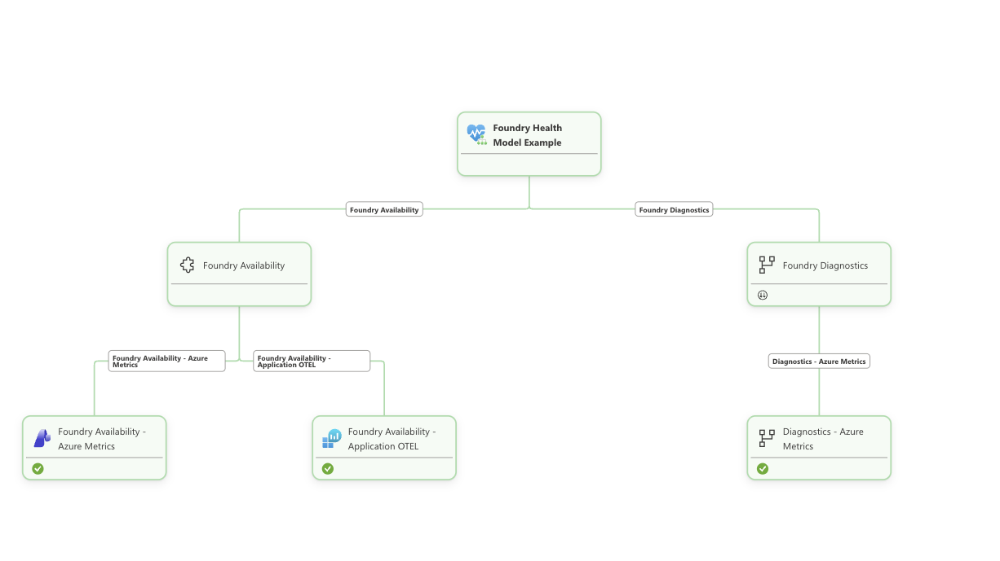
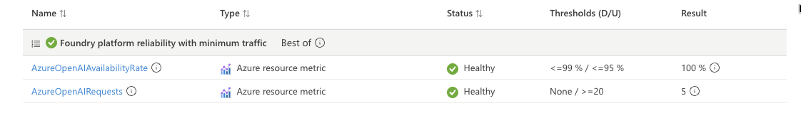

# Azure Monitor Health Model Sample for Microsoft Foundry

This repository demonstrates a reusable Azure Monitor Health Model for Microsoft Foundry. Direct Azure metrics provide the complete service-side baseline. An optional OpenTelemetry (OTEL) path enriches that baseline with a workload-observed perspective, while diagnostic anomalies remain separate from availability.

## Health Model structure

```text
Foundry Health Model Example
├── Foundry Availability
│   ├── Foundry Availability - Azure Metrics
│   └── Foundry Availability - Application OTEL
└── Foundry Diagnostics (suppressed)
    └── Diagnostics - Azure Metrics
```

Foundry Availability is the only branch that affects root health and owns the Sev2/Sev1 alert policy. Diagnostics owns the Sev3 anomaly policy but is suppressed from root health.

The Application OTEL child is optional. A model that uses only Azure Metrics still provides gated availability and all platform diagnostics shown here; the reference deployment includes OTEL to demonstrate how workload telemetry can add context.



## Signals

**Full catalog:** The [Azure OpenAI monitoring data reference](https://learn.microsoft.com/azure/foundry/openai/monitor-openai-reference#metrics) lists every available platform metric, including its REST API name, dimensions, supported aggregation, time grain, and diagnostic settings export support. The catalog covers multiple models, deployment types, and features, so not every metric is emitted by every Foundry resource.

The Azure Metrics baseline uses 12 signals. The optional OTEL availability child adds two more, for 14 signals in the reference deployment:

| Entity | Technical signals | Purpose | Rollup |
| --- | --- | --- | --- |
| [Foundry Availability - Azure Metrics](infra/health-model-foundry-signals.bicep) | `AzureOpenAIAvailabilityRate`, `AzureOpenAIRequests` | Service-side availability gated by request volume | Foundry Availability, Sev2/Sev1 |
| [Foundry Availability - Application OTEL](infra/health-model-observability.bicep) (optional) | `foundry.availability_rate`, `foundry.requests` | Enriches service metrics with workload-observed availability using the same gate | Foundry Availability, Sev2/Sev1 |
| [Diagnostics - Azure Metrics](infra/health-model-observability.bicep) | `TokenTransaction`, `AzureOpenAINormalizedTBTInMS`, `GeneratedTokens`, `AzureOpenAITTLTInMS`, `AzureOpenAINormalizedTTFTInMS`, `ProcessedPromptTokens`, `RAIRejectedRequests`, `RAIHarmfulRequests`, `RAISystemEvent`, `RAITotalRequests` | Remaining usable platform anomaly signals | Foundry Diagnostics, suppressed, Sev3 |

### Recommended availability signal

Combine `AzureOpenAIAvailabilityRate` with `AzureOpenAIRequests` to avoid signal noise. Availability shows the percentage of calls that didn't return HTTP 5xx, while request count shows whether there is enough traffic to trust that percentage. Either metric alone is incomplete: availability can be noisy at low volume, and request count doesn't show whether calls succeeded.

Use a `BestOf` group as a minimum-traffic gate. Below 20 requests, the group stays Healthy; at 20 or more requests, it follows availability. This requires **enough traffic and bad availability** before health is affected.

The Azure Metrics signals and `BestOf` group are defined in [`infra/health-model-foundry-signals.bicep`](infra/health-model-foundry-signals.bicep).



*The grouped view shows both the availability result and the request volume behind it.*

> **Other status codes:** To gate on responses such as 403, filter another `AzureOpenAIRequests` signal with `dimension: 'StatusCode'` and `dimensionFilter: '403'`, then combine it with the same minimum-request gate. Use KQL or OTEL instead when you need a percentage rather than a count.

### Why these signals

| Signal group | Why it was selected | Why it rolls up this way |
| --- | --- | --- |
| `AzureOpenAIAvailabilityRate` + `AzureOpenAIRequests` | Availability supplies the outcome, while request volume supplies its sample size. Together they distinguish a noisy percentage based on a few calls from a sustained reliability problem. | This is the clearest service-side reliability outcome, so it can affect availability and trigger Sev2/Sev1. |
| `foundry.requests` + `foundry.server_errors` (optional) | These counters reproduce the same request/HTTP 5xx calculation at the workload's logical-operation boundary. | Provides an alternative telemetry path that can enrich the service-side view. |
| Latency: `AzureOpenAINormalizedTTFTInMS`, `AzureOpenAINormalizedTBTInMS`, `AzureOpenAITTLTInMS` | Together they cover initial responsiveness, token-generation cadence, and completion time. Each captures a different part of perceived model latency. | Expected latency varies with model, streaming mode, prompt size, and generated output, so anomalies are diagnostic rather than direct availability failures. |
| Tokens: `ProcessedPromptTokens`, `GeneratedTokens`, `TokenTransaction` | Input, output, and total inference-token volume explain workload shape, usage, and cost. They also provide the context Microsoft recommends pairing with latency: slower responses accompanied by more tokens can be expected behavior. | Token volume is workload-dependent, so dynamic anomalies produce only suppressed Sev3 diagnostics. |
| Content safety: `RAIRejectedRequests`, `RAIHarmfulRequests`, `RAISystemEvent`, `RAITotalRequests` | These show blocked volume, detected harmful content, safety-system events, and the total volume checked. Together they provide context for whether a change is isolated or proportional to traffic. | A blocked request usually means a guardrail worked correctly, not that Foundry is unavailable, so these signals never affect root health. |

### Azure Metrics are the baseline; OTEL is optional enrichment

The model doesn't require OTEL. Direct Azure resource metrics are sufficient for Foundry availability and diagnostics. OTEL adds a second observation point when workload-level context is useful:

The optional OTEL queries and signal definitions are in [`infra/health-model-observability.bicep`](infra/health-model-observability.bicep).

| Path | Role | Observation point | Why use it | Trade-offs |
| --- | --- | --- | --- | --- |
| Azure resource metrics | Baseline | Foundry service | Lowest complexity; authoritative service-side request, latency, token, and safety telemetry; no workload instrumentation required | Limited to metrics and dimensions emitted for that Foundry deployment |
| OTEL through Application Insights and Log Analytics | Optional enrichment | Workload code | Adds logical-operation counting, portable semantics, customizable failure definitions, and correlation with other workload telemetry | Requires instrumentation, ingestion, query access, and tolerance for telemetry delay; can't recreate provider-only safety or system signals |

The reference deployment enables both paths so their availability results can be compared. The OTEL path records low-cardinality `foundry.requests` and `foundry.server_errors` counters once per logical Foundry operation, then queries `AppMetrics` over a completed, delayed five-minute window. This can expose differences in observation boundaries and connect Foundry health to the rest of the workload's telemetry.

OTEL intentionally mirrors only request volume and HTTP 5xx availability in this sample; latency, token, and content-safety diagnostics continue to use direct Azure metrics. If the extra workload perspective isn't needed, omit the Application OTEL child and retain the Azure Metrics branch unchanged. When using OTEL, keep attributes low-cardinality and exclude prompt text, response content, and user identifiers.

For private OTEL ingestion and Health Model query access, see the [AMPLS recommendation for Health Models and OpenTelemetry metrics](docs/ampls-health-model-otel-recommendation.md).

### Diagnostics and dynamic thresholds

Diagnostics use low-sensitivity dynamic thresholds to identify unusual behavior rather than fixed service-level failures. They require representative history and can remain in a learning state for several days.

The diagnostic metric signals and dynamic-threshold rules are defined in [`infra/health-model-observability.bicep`](infra/health-model-observability.bicep).

| Signal status | Meaning |
| --- | --- |
| Numeric value, `Unknown`, and no error | The dynamic threshold is still learning that metric series |
| No value, `Unknown`, and no error | The metric produced no sample in the evaluation window or isn't emitted by that deployment |
| `Unknown` with an error | The metric name, query, permissions, or data source configuration failed |

Dynamic thresholds generally need at least three days and 30 samples before they can classify a series, with longer history required for daily or weekly seasonality. Because Diagnostics is suppressed and ignores unknown children, learning and missing-data intervals don't affect availability or create Sev3 alerts.

## Health Model templates

| Template | Purpose |
| --- | --- |
| [`infra/health-model-metrics.bicep`](infra/health-model-metrics.bicep) | Grants the Health Model identity access to Azure metrics and Log Analytics |
| [`infra/health-model-foundry-signals.bicep`](infra/health-model-foundry-signals.bicep) | Configures gated Azure Metrics availability on the Foundry entity |
| [`infra/health-model-observability.bicep`](infra/health-model-observability.bicep) | Creates the Availability and Diagnostics hierarchy, OTEL availability, diagnostic signals, relationships, and alerts |

## References

- [Azure OpenAI monitoring data reference](https://learn.microsoft.com/azure/foundry/openai/monitor-openai-reference)
- [Azure Monitor Health Model concepts](https://learn.microsoft.com/azure/azure-monitor/health-models/concepts)
- [Configure signals in Azure Monitor Health Models](https://learn.microsoft.com/azure/azure-monitor/health-models/signals)

## Reproduce this example

To reproduce the Health Model and its telemetry, deploy the included example workload by following [`DEPLOYMENT.md`](DEPLOYMENT.md).

The deployment also includes a one-minute, low-token synthetic Foundry probe. It is diagnostic traffic rather than a Health Model input and remains below the default availability traffic gate.
